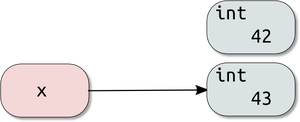
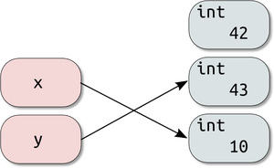

Nomes e referências
===================

Entendendo o conceito
---------------------

Em Python, uma variável é apenas um NOME que REFERENCIA a um OBJETO.

.. code-block:: python

    ## Atribuição simples
    x = 42

X recebe 42. Certo?

O que o python faz é criar um objeto com valor igual a 42 e criar um nome que
referencie esse objeto.
Toda vez que o nome aparecer no código, o objeto do tipo int seja substituido no código.

.. image:: img/var1.png
    :align: center

.. nextslide::

.. code-block:: python

    ## Incrementando
    x += 1
    # ou x = x + 1

X recebe 43. Certo?

O nome 42 passa a fazer referência a um novo objeto int de valor 43.

**Objetos do tipo int são imutáveis.**

"x = x + 1" cria um novo objeto do tipo int e faz com que x passe a referenciar esse novo objeto.
Se você observar:

.. code-block:: python

    ## Incrementando
    x = 13
    id1 = id(x)
    x += 1
    id2 = id(x)
    id1 == id2

São objetos diferentes.

.. nextslide::

.. code-block:: python

    # Copiando referência
    y = x

O interpretador cria um novo nome y e faz referência ao objeto int de valor 43.

.. image:: img/var3.png
    :align: center

.. nextslide::

.. code-block:: python

    # Alterando o valor de x
    x = 10

Como objetos do tipo int são imutáveis, ao executar a expressão acima estamos
fazendo uma nova referencia ao nome "x".
Isto é, o interpretador cria um novo objeto int de valor 10 e atualiza
a referência do nome "x".

.. nextslide::

**Objetos do tipo lista são Mutáveis.**

Significa que ao criar um nome referenciando um objeto lista,
conseguimos editar o objeto. Vejamos:

.. code-block:: python

    # Criando uma nova lista
    x = [1, 2, 3]
    # copiando referencia
    y = x
    # Editando a lista
    x.append(4)
    # Visualizando a lista atualizada
    print (x)
    [1, 2, 3, 4]
    # y faz referência a mesma lista
    print (y)
    [1, 2, 3, 4]

.. nextslide::

As referências de nome (x e y) são para o mesmo objeto do tipo lista.

.. image:: img/var5.png
    :align: center

O método append() modifica a lista de modo in-place, isto é, as modificações são feitas no
próprio objeto, sem a necessidade de criação de uma nova lista, como
ocorreria com objetos imutáveis, como strings ou ints, por exemplo.

Referência: `Python Help <https://pythonhelp.wordpress.com/2013/02/20/variaveis-valores-e-referencias/>`_.